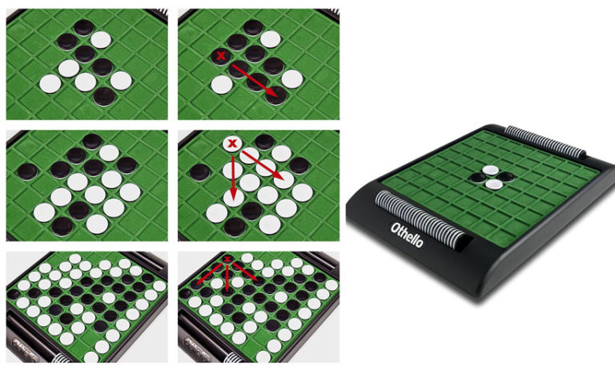

# Théorie des jeux : Othello

Projet d'informatique de l'UE _Informatique Avancée : Modélisation Numérique et Programmation Orientée Objet C++_ dans le cadre d'une formation en Master 1/Magistère 2 de Physique Fondamentale à l'Université Paris-Saclay. Sujet Libre. Langage de programmation majoritairement en C++. Par Elianor Hoffmann et Pierre Boistier.

## Exécution

**Pour le programme en C++** : Se placer dans le dossier, dans le même répertoire que le fichier Makefile. Lancer **make all** puis **./Othello**. Une fois l'utilisation terminée, **make clean**, ou **make dist-clean** pour une remise à zéro du dossier.

**Pour l'analyse de données** : Ouvrir graphiques.ipynb avec Jupyter.

## Contexte
_Reversi_ (1880, Angleterre, Lewis Waterman et John W. Mollet), aussi connu sous le nom _Othello_ (1971, Japon, Goro Hasegawa) est un jeu de société combinatoire abstrait pouvant rappeler les jeux de dames, échecs ou go par son plateau, ses pions et ses mécanismes. Il se joue sur un plateau unicolore de 8x8 cases, appelé othellier (_cf_. Figure 1). Les joueurs disposent de 64 pions bicolores, noirs d’un côté et blancs de l’autre. Les joueurs jouent à tour de rôle, chacun étant tenu de capturer des pions adverses lors de son mouvement. La capture de pions survient lorsqu’un joueur place un de ses pions à l’extrémité d’un alignement de pions adverses contigus et dont l’autre extrémité est déjà occupée par un de ses propres pions (_cf_. Figure 1). Le jeu s’arrête quand les deux joueurs ne peuvent plus poser de pion. Le gagnant en fin de partie est celui qui possède le plus de pions de sa couleur. 

 Figure 1 - _A droite, othellier en début de partie. A gauche, de gauche à droite et de haut en bas, trois exemples de coups à l’othello. Placer un pion sur la même ligne, colonne ou diagonale qu’un autre des pions de la même couleur capture les pions de la ligne, diagonale ou colonne._

Coder un jeu de société est un projet qui se prête particulièrement à une programmation orientée objet. En effet, l’utilisation de classes est naturelle, que ce soit pour coder le plateau, les joueurs humains et les joueurs "ordinateurs". L’hérédité sera notamment pertinente lorsqu’il s’agira de complexifier progressivement les algorithmes de jeu dits "ordinateurs", un joueur (sauf pour le premier) étant une classe fille d’un joueur avec une approche plus simpliste.

## Approche - Méthode
L’objectif premier du projet est de coder, en C++ et en Python pour l’interface graphique dynamique, un othellier et des classes de joueurs humains pour jouer en 1v1. Dans un second temps, il s’agira d’implémenter des classes de joueurs dits "ordinateurs" plus ou moins complexes :

* méthode aléatoire : l’algorithme joue aléatoirement un des coups autorisés, à chaque tour ;
* méthode "projection sur 1 tour" : l’algorithme optimise le coup pour capturer le plus de pions à chaque tour, sans se projeter au-delà ;
* algorithme _minimax_ : modélisation des coups futurs à l’aide d’arbres de recherche.

L’algorithme _minimax_ pourra donner lieu à plusieurs joueurs, en fonction du nombre de coups futurs que l’on demande à l’algorithme de prévoir, mais aussi en améliorant cet algorithme via des techniques dites _alpha-beta_. Enfin, on s’intéressera à des améliorations propres à _Othello_, comme trier les coups, effectuer des recherches sélectives, utiliser des tables de transposition ou démarrer une partie avec des ouvertures stratégiques.

Finalement, l’objectif est de comparer toutes ces différentes méthodes en simulant de nombreuses parties et en observant les nombre moyen et écart-type des pions sur le plateau en fin de partie. Il s’agira ainsi de déterminer l’algorithme le plus efficace pour gagner à _Othello_, en nombre de victoires, en nombre de pions sur le plateau en fin de partie, et en temps d’exécution.

## Références bibliographiques
\[1] : _Page Wikipedia de Othello (jeu)._ adresse : fr.wikipedia.org/wiki/Othello_(jeu) ;   
\[2] : _Site internet de la Fédération Française d’Othello._ adresse : www.ffothello.org .

# Règles du jeu 

### Matériel
* 1 plateau unicolore de 8x8 cases (othellier). Les lignes sont numérotées de haut en bas de 1 à 8 et les colonnes sont étiquetées de gauche à droite, de ‘a’ à ‘h’.
* 64 pions bicolores (noirs d'un côté et blancs de l'autre). 

### But du jeu 
Posséder le plus de pions de sa couleur en fin de partie

### Position de départ
Noir commence.

### Poser un pion
A son tour de jeu, le joueur doit poser un pion de sa couleur. Trois conditions sont nécessaires :
1. le pion doit être posé sur une case vide ;
2. la case doit être adjacente à un pion adverse ;
3. retourner obligatoirement un pion en prenant en Sandwich: le pion posé doit encadrer un (ou plusieurs) pions adverses entre le pion qu’il pose et un pion de sa couleur, déjà placé sur l’othellier. (_cf_. section suivante)

Si le joueur ne peut répondre à ces 3 conditions, il ne peut poser et doit passer.

### Retourner les pions pris en sandwich
Il retourne alors de sa couleur le ou les pions qu’il vient d’encadrer. Les pions ne sont ni retirés de l’othellier, ni déplacés d’une case à l’autre. L’encadrement peut être effectué dans les 8 directions (les diagonales sont donc possibles). Les réactions en chaîne ne sont pas possibles.

### Fin du jeu
Lorsqu’aucun coup légal n’est possible de la part des deux joueurs. Cela intervient généralement lorsque les 64 cases sont occupées.

# Implémentation

Implémentation en C++, Python3.

# Progression

État des objectifs le 16 février 2022 :
- [x] Comprendre les enjeux du jeu _Othello_ ;
- [x] Implémenter un environnement et une interface permettant de jouer à _Othello_ ;
- [x] Concevoir et implémenter des algorithmes dits "ordinateurs" pour jouer à _Othello_ ;
- [x] Comparer les performances (en terme de résultats) des différents algorithmes et en tirer une conclusion ;
- [ ] Comparer les algorithmes en temps ;
- [ ] Améliorer MinMax avec des méthodes de coupures AlphaBeta ;
- [ ] Coder de nouveaux ordinateurs en utilisant des algorithmes propres à _Othello_.
